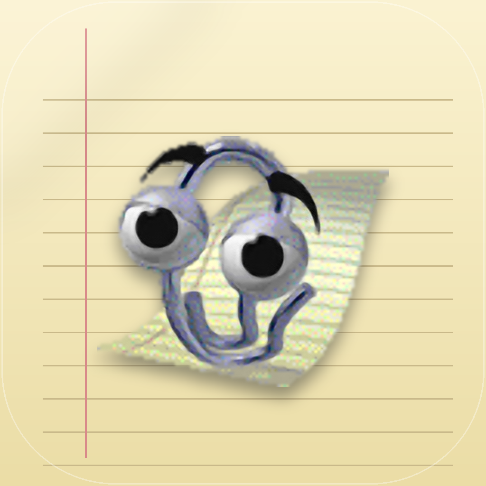

<p align="center">
  
</p>

<h1 align="center">Clippy</h1>

<p align="center">
  <strong>Язык:</strong> <a href="README.md">EN</a> | RU
</p>

<p align="center">
  <strong>легендарный скрепыш из Office, возрождённый на macOS</strong>
</p>

<p align="center">
  
  
  
  
</p>

`Clippy` - небольшое приложение для macOS, которое возрождает легендарного скрепыша. Время от времени, пока экран активен, скрепыш выныривает в углу, проигрывает анимацию и показывает факт или совет в речевом баллоне. Нативный Swift, menu bar agent, ноль зависимостей.

## Возможности

- **menu bar agent** - сам скрепыш иконкой в трее; клик открывает меню (Показать сейчас / Проиграть жест / Настройки… / О программе / Выход), «Настройки…» открывают окно.
- **где показывать** - трей и/или иконка в доке (по умолчанию оба). Скрыть можно каждое; если скрыты оба, окно настроек открывается при запуске уже запущенного приложения.
- **скрепыш** - прозрачное окно поверх всех окон и Spaces, не ворует фокус.
- **живой idle** - вероятностные переходы кадров (branching) и случайные idle-жесты.
- **взаимодействие** - левый клик = новый факт с жестом, правый клик = меню, перетаскивание мышью с запоминанием позиции.
- **частота** - произвольное число минут, применяется на лету.
- **детект активности** - не показывается на залоченном или спящем экране и когда вас нет.
- **размер** - масштаб скрепыша от ×0.5 до ×2.
- **звук** - оригинальная озвучка анимаций (по умолчанию выключена).
- **snooze** - «заткнуть на час» из контекстного меню.
- **автозапуск** - при входе в систему (LaunchAgent).
- **контент** - ~600 встроенных реплик в характере скрепыша, с фильтром по категориям, плюс провайдеры Ollama / Claude / RSS / facts-API с автоматическим фолбэком на локальный.
- **прогулка** - из меню скрепыш доходит до случайной точки экрана и жестикулирует.
- **персонажи** - встроенный скрепыш плюс свои персонажи из папки `Agents` (каждый - подпапка с `agent.json` + `map.png`), переключение в настройках.
- **о программе** - панель с версией приложения.

## Установка

### из готового .dmg

Соберите образ и перетащите `ClippyMac.app` в `Applications`:

```bash
./scripts/build-dmg.sh
open build/ClippyMac.dmg
```

При первом запуске незаверенного приложения: правый клик по `.app` и «Открыть».

### из исходников

```bash
swift run
```

Требуется macOS 13+ и Swift toolchain / Xcode.

## Источники контента

Источник выбирается в настройках, там же поля провайдеров (ключ Claude хранится в Keychain, а не открытым текстом).

- **Локальные советы** - из коробки: ~600 реплик скрепыша, категории переключаются в настройках.
- **Ollama** - запущенный `ollama serve` и модель; адрес и модель задаются в настройках (или через `CLIPPY_OLLAMA_URL` / `CLIPPY_OLLAMA_MODEL`).
- **Claude** - ключ API вставляется в настройках (или `ANTHROPIC_API_KEY`).
- **RSS** - адрес ленты в настройках (или `CLIPPY_RSS_URL`).
- **Факты из интернета** - из коробки.

## Разработка

Проверка логики без GUI (парсинг спрайтов, кроп кадров, branching, звуки, границы джиттера, контент):

```bash
CLIPPY_SELFTEST=1 swift run
```

Отладка частоты: `CLIPPY_INTERVAL_SEC`, `CLIPPY_FIRST_DELAY_SEC`.

План и бэклог - в [PLAN.md](PLAN.md).

## Credits & assets

- спрайты, тайминги анимаций и звуки взяты из [ClippyJS](https://github.com/smore-inc/clippy.js) (MIT), которые в свою очередь происходят из **Microsoft Agent** (персонаж «Clippit»)
- идея desktop-агента и часть фич вдохновлены [Cosmo/Clippy](https://github.com/Cosmo/Clippy)

Спрайты и звуки остаются интеллектуальной собственностью правообладателей и включены для личного некоммерческого использования. MIT-лицензия проекта покрывает только исходный код.

## Лицензия

[MIT](LICENSE) - на исходный код. По ассетам см. раздел выше.
